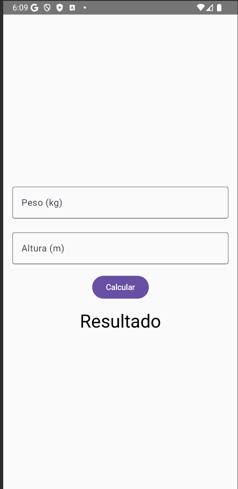
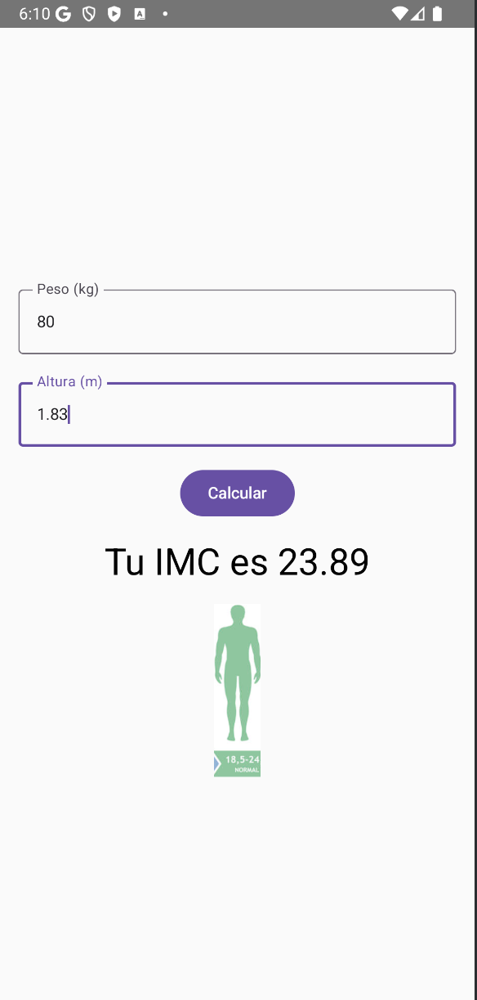

# IMC App

Una aplicación Android para calcular el Índice de Masa Corporal (IMC) utilizando Kotlin y Jetpack Compose.

## Descripción

Esta aplicación permite al usuario ingresar su peso (en kilogramos) y altura (en metros) para calcular su IMC. Dependiendo del resultado, se muestra una imagen que indica si el IMC se encuentra en un rango de insuficiencia, saludable o sobrepeso.

La fórmula utilizada es:  
\[
\text{IMC} = \frac{\text{peso}}{\text{altura}^2}
\]

## Características

- **Entrada de datos:** Dos campos para ingresar peso y altura.
- **Validación:** Comprueba que los valores ingresados sean numéricos y que la altura sea mayor a cero.
- **Cálculo y visualización:** Muestra el IMC calculado y una imagen representativa según el rango.
- **Interfaz moderna:** Creada con Jetpack Compose.

## Capturas de Pantalla

A continuación se muestran ejemplos de cómo se ve la aplicación al ejecutarse:


*Pantalla donde se ingresan los datos de peso y altura.*


*Pantalla que muestra el resultado del cálculo del IMC junto con la imagen correspondiente.*

> **Nota:** Asegúrate de guardar las imágenes (por ejemplo, `screenshot_entrada.png` y `screenshot_resultado.png`) en una carpeta llamada `images` en la raíz del proyecto.

## Estructura del Proyecto

- **app/src/main/java/com/example/imcapp/MainActivity.kt:** Código principal con la lógica de la aplicación.
- **app/src/main/res/drawable/:** Carpeta que contiene las imágenes referenciadas en el código (`insuficiente`, `saludable`, `sobrepeso`).
- **images/:** Carpeta opcional (a nivel de la raíz) para incluir capturas de pantalla y otros recursos gráficos usados en el README.

## Requisitos

- Android Studio
- Android SDK
- Gradle

## Instalación y Ejecución

1. **Clonar el repositorio:**
   ```bash
   git clone https://github.com/https://github.com/AhkahfrinDrakengard/Actividad_Interfaz
